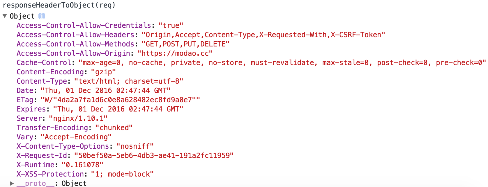

# javascript-utils

#### responseHeaderToObject
Get the `response Headers` as an `Object`
```javascript
var req = new XMLHttpRequest();
req.open('GET', document.location, false);
req.send(null);
var headers = req.getAllResponseHeaders();

responseHeaderToObject(req);
```



